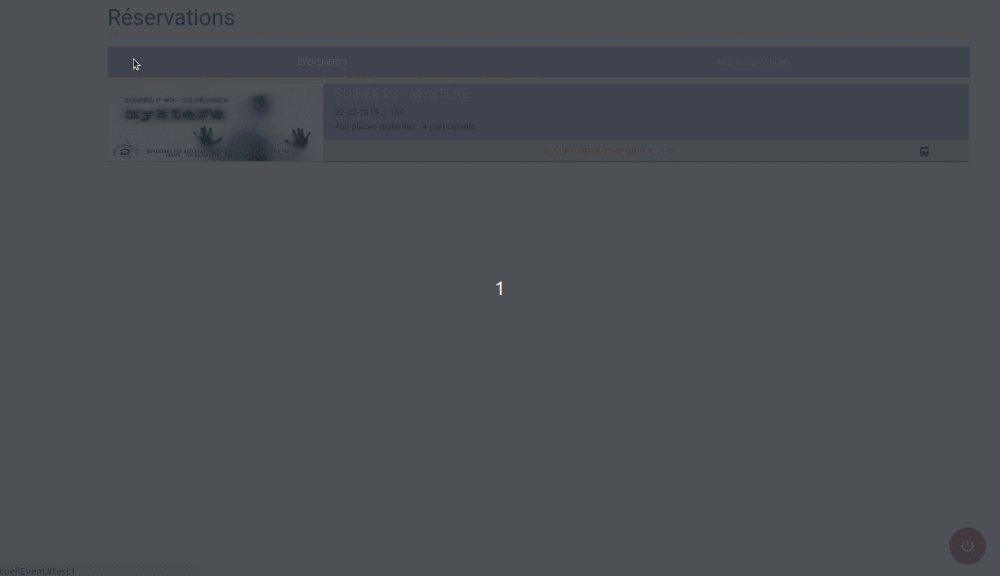

# Polytech booker

Clone repository and install packages
```
git clone https://github.com/Rifhice/polytech-booker.git
cd polytech-booker
npm install
```
Grab the event url on the official website


Fill out the env variables
```
cp model.env .env
nano .env
```
Start with
```
node index.js
```