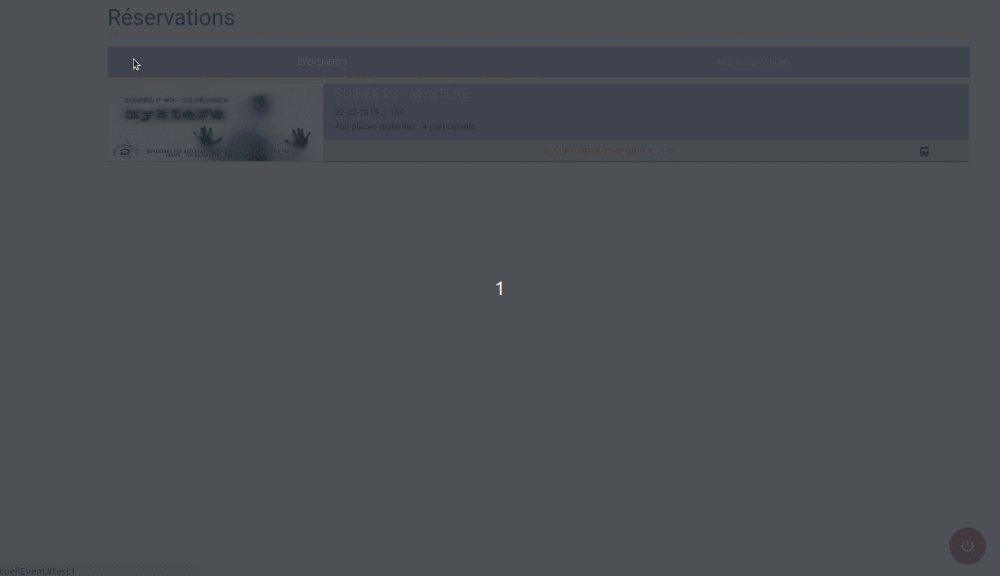

# Polytech booker

Clone repository and install packages
```
git clone https://github.com/Rifhice/polytech-booker.git
cd polytech-booker
npm install
```
Grab the booking url for the event on the official website
 - Inspect the bus button to grab the event ID (usually a number)
 - Open the div with the ID modalXX, where XX is the event ID
 - The url can be found in the modal-footer div (usually with the format https://bde.polytechmontpellier.fr/Event/bookEvent/XX)


Fill out the env variables
```
cp model.env .env
nano .env
```
Start with
```
node index.js
```